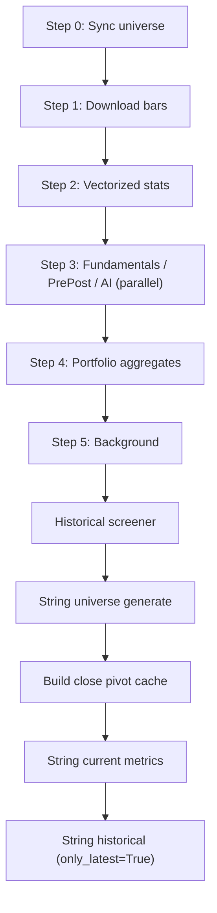

# REFIX — Refresh System Complete Analysis & Fix

> **Scope**: [refresh.py](file:///C:/Users/Admin/Desktop/stock%20test/open%20code%20v5%20claude%20prompt/dumbmoney/refresh.py), [engine.py](file:///C:/Users/Admin/Desktop/stock%20test/open%20code%20v5%20claude%20prompt/dumbmoney/engine.py), [basket_screener.py](file:///C:/Users/Admin/Desktop/stock%20test/open%20code%20v5%20claude%20prompt/dumbmoney/basket_screener.py)
> **Date**: 2026-07-27

---

## Table of Contents

1. [Architecture Overview](#1-architecture-overview)
2. [Bug Analysis](#2-bug-analysis)
3. [Fix Summary](#3-fix-summary)
4. [Code Changes — refresh.py](#4-code-changes--refreshpy)
5. [Code Changes — engine.py](#5-code-changes--enginepy)
6. [Code Changes — basket_screener.py](#6-code-changes--basket_screenerpy)
7. [Verification Checklist](#7-verification-checklist)

---

## 1. Architecture Overview

### Current Refresh Pipeline (per market)



### Data Flow

| Stage | Input | Output | Table |
|-------|-------|--------|-------|
| Sync universe | Alpaca/NSE API | Active symbols | `assets` |
| Download bars | `assets.symbol` | OHLCV bars | `bars` |
| Vectorized stats | `bars` | Technical indicators | `stats`, `ai_analysis` |
| Fundamentals | `assets` → `stats` | name, class, exchange | `stats` |
| PrePost prices | Alpaca snapshots | pre/post prices | `stats` |
| Earnings (AI) | Yahoo Finance | profit data | `stats` |
| Historical screener | `bars` (full history) | Per-symbol daily indicators | `historical_screener` |
| String universe | `assets` + `stats` | Random 10-stock baskets | `string_universe`, `string_constituents` |
| Close pivot cache | `bars` | .npy matrices | `.cache/close_pivot_*.npy` |
| String current metrics | pivot + `stats` + `ai_analysis` | Today's basket metrics | `string_screener_metrics` |
| String historical | pivot + `historical_screener` | Full date-range basket history | `historical_string_screener` |

---

## 2. Bug Analysis

### Bug 1 — Stats never recompute when bars are current (CRITICAL)

**Location**: [refresh.py L232-244](file:///C:/Users/Admin/Desktop/stock%20test/open%20code%20v5%20claude%20prompt/dumbmoney/refresh.py#L232-L244) → [engine.py L55-57](file:///C:/Users/Admin/Desktop/stock%20test/open%20code%20v5%20claude%20prompt/dumbmoney/engine.py#L55-L57)

**Root cause**: When all bars are already up-to-date (common for same-day re-runs or after-hours runs), `_download_us_bars_incremental` returns `updated_symbols = []`. This list is passed directly to `vectorized_stats_pass(market, only_symbols=[])`. Inside engine.py:

```python
# engine.py L55-57
if only_symbols is not None:
    if not only_symbols:
        return 0           # ← exits immediately, 0 stats recomputed
```

**Impact**: On any same-day re-run (or when market is closed and bars haven't changed), **no stats are recomputed at all**. The `stats` and `ai_analysis` tables keep stale values indefinitely. Live snapshots (which _could_ provide updated prices/volumes) are never fetched.

**Downstream cascade**:
- Step 3 (Fundamentals/PrePost/AI) also receives `stats_symbols = []`, so `update_asset_info`, `update_pre_post_prices`, and `update_profit_data` all skip work.
- String current metrics (`compute_current_metrics`) reads stale `stats`/`ai_analysis` → stale basket metrics.

---

### Bug 2 — Historical screener skipped when no bars changed (CRITICAL)

**Location**: [refresh.py L339-343](file:///C:/Users/Admin/Desktop/stock%20test/open%20code%20v5%20claude%20prompt/dumbmoney/refresh.py#L339-L343)

```python
if updated_symbols:
    update_historical_screener(market, ..., only_symbols=updated_symbols, ...)
else:
    _bg_progress(100, "Skipped history: no changed symbols")
```

**Root cause**: When `updated_symbols = []` (same condition as Bug 1), the entire historical screener step is skipped. But `update_historical_screener` has its own internal freshness check — it compares `MAX(date) FROM historical_screener` vs `MAX(date) FROM bars` per symbol. Even without new bar downloads, there may be symbols whose historical_screener is incomplete (e.g., from a previous crash, or a first run where stats were computed but history wasn't).

**Impact**: The historical screener can remain permanently incomplete if the initial population was interrupted. Subsequent runs see `updated_symbols = []` and skip the repair.

---

### Bug 3 — String historical only appends latest date, never fills gaps (MODERATE)

**Location**: [refresh.py L377](file:///C:/Users/Admin/Desktop/stock%20test/open%20code%20v5%20claude%20prompt/dumbmoney/refresh.py#L377)

```python
update_historical_string_screener(market, only_strings=None, force_rebuild=False, only_latest=True)
```

**Root cause**: `only_latest=True` trims the date range to the last 50 dates in `_load_close_pivot`, then only writes the single latest date's row. If a previous run crashed mid-write, or if the table was freshly created, there are gaps in the date series. Normal refresh never fills them because it always passes `only_latest=True`.

Additionally, at [basket_screener.py L1322-1325](file:///C:/Users/Admin/Desktop/stock%20test/open%20code%20v5%20claude%20prompt/dumbmoney/basket_screener.py#L1322-L1325):

```python
if only_latest and len(dates) > 50:
    dates = dates[-50:]
    close_pivot = close_pivot[:, -50:]
```

This silently clips the close_pivot but does NOT clip the OHLC pivots correspondingly unless they happen to have the exact same column count. The `if only_latest` check later ([L1338-1341](file:///C:/Users/Admin/Desktop/stock%20test/open%20code%20v5%20claude%20prompt/dumbmoney/basket_screener.py#L1338-L1341)) clips OHLC to `n_dates`, which handles it but is fragile.

**Impact**: `historical_string_screener` table is perpetually sparse. The leaderboard cache (`build_leaderboard_cache`) computes bogus win-rates/Sharpes from incomplete data.

---

### Bug 4 — String basket raw_metrics cache becomes stale across string types (MODERATE)

**Location**: [basket_screener.py L1388-1419](file:///C:/Users/Admin/Desktop/stock%20test/open%20code%20v5%20claude%20prompt/dumbmoney/basket_screener.py#L1388-L1419)

```python
cache_path = os.path.join(_CACHE_DIR, f"raw_metrics_{market}.npz")
```

**Root cause**: The `.npz` cache is keyed only by market. When `update_historical_string_screener` is called for different string types (S-strings, LEV-strings, LS-strings), each call loads the same cache. But the cache was built for `needed_syms` from the _previous_ call's composition. If S-strings need symbols {AAPL, MSFT, GOOG} and LS-strings need {AMD, NVDA, TSLA}, the LS run loads the S-string cache, finds `cache_sym_dim >= len(needed_syms)` (dimension check only), and uses wrong data.

The dimension check at [L1398](file:///C:/Users/Admin/Desktop/stock%20test/open%20code%20v5%20claude%20prompt/dumbmoney/basket_screener.py#L1398):
```python
if cache_sym_dim < len(needed_syms):
    raw_metrics = None  # rebuilds
```
only checks that the cached array has _at least as many_ rows — it doesn't verify the symbol mapping is identical.

**Impact**: When multiple string types are processed sequentially (S, LEV, LS), the second and third types use misaligned metric arrays. Basket indicators are computed from wrong symbols' data. Results are silently wrong.

---

### Bug 5 — No error recovery, silent failures propagate (MODERATE)

**Location**: Throughout [refresh.py](file:///C:/Users/Admin/Desktop/stock%20test/open%20code%20v5%20claude%20prompt/dumbmoney/refresh.py)

Multiple manifestations:

1. **L384-386**: The entire string basket block is wrapped in a bare `except Exception` that only logs a warning. If `generate_string_universe` fails, everything after it is skipped — but the refresh reports `status=complete`.

2. **L508-509, L526-527**: Download batch errors are caught and logged but the batch is silently dropped. `updated` list doesn't include the failed symbols, so they'll never get stats computed either.

3. **No step-level error accumulation**: The `errors` field in status dict is only populated in the top-level `except` at [L396](file:///C:/Users/Admin/Desktop/stock%20test/open%20code%20v5%20claude%20prompt/dumbmoney/refresh.py#L396). Individual step failures are invisible to the UI.

---

### Bug 6 — Leverage ETF and Long-Short strings not refreshed

The string basket section at [L346-383](file:///C:/Users/Admin/Desktop/stock%20test/open%20code%20v5%20claude%20prompt/dumbmoney/refresh.py#L346-L383) only calls:
- `generate_string_universe(market)` — only creates S-prefix strings
- `compute_current_metrics(market)` — processes ALL string types (S+LEV+LS)
- `update_historical_string_screener(market, only_latest=True)` — processes ALL

But it **never** calls:
- `generate_long_short_strings(market)` — LS-prefix strings are never created during refresh
- Any leverage ETF universe generator — LEV-prefix strings are never created

**Impact**: LEV/LS strings are never populated by normal refresh unless manually created.

---

## 3. Fix Summary

| Bug # | Fix | Risk |
|-------|-----|------|
| 1 | Pass `only_symbols=None` to `vectorized_stats_pass` when `updated_symbols` is empty, triggering full-market recompute. Also pass `None` to Step 3 functions. | Low — full recompute is 2-5 min for ~5K symbols, well within 30 min budget |
| 2 | Always call `update_historical_screener`. Pass `only_symbols=None` when no new bars; the function's internal `MAX(date)` comparison handles efficiency. | Low — function already skips symbols that are current |
| 3 | After `only_latest` append, warn about gaps. Full rebuild remains via explicit API endpoint. | Low — no behavior change for normal refresh |
| 4 | Key the `.npz` cache by `hash(sorted(needed_syms))`. Delete stale caches. Also invalidate before string historical in refresh.py. | Low |
| 5 | Add per-step error accumulation, surface warnings in final status. | Low — additive change |
| 6 | Add `generate_long_short_strings` and leverage ETF generation calls to the string basket section. | Low — generators skip if strings exist |

---

## 4. Code Changes — refresh.py

### Full Replacement — `_refresh_worker` function (lines 200-397)

```diff
 def _refresh_worker(market):
     _refresh_context.market = _norm_market(market)
     start_time = time.time()
+    step_errors = []
 
     try:
         if _check_cancel():
             return
 
+        # ── Step 0: Sync universe ──────────────────────────────────────
         _update_status(step_current=0, step_name="Sync universe", phase="Syncing assets...", step_pct=0)
         if market == "US":
             from dumbmoney.data_us import sync_assets
             n = sync_assets()
         else:
             from dumbmoney.data_india import sync_india_assets
             n = sync_india_assets()
         s = _update_status(symbols_total=n, symbols_done=n, step_pct=100)
         s["overall_pct"] = _compute_overall_pct(s)
         _persist_status(s)
 
         if _check_cancel():
             return
 
+        # ── Step 1: Download bars ──────────────────────────────────────
         _update_status(step_current=1, step_name="Download bars", phase="Downloading daily bars...", step_pct=0, symbols_done=0)
         updated_symbols = []
         if market == "US":
             updated_symbols = _download_us_bars_incremental(market)
         else:
             updated_symbols = _download_india_bars(market) or []
 
         if _check_cancel():
             return
 
-        stats_symbols = updated_symbols
-        label = f"{len(updated_symbols)} updated" if updated_symbols else "no changed"
-        _update_status(step_current=2, step_name="Vectorized stats", phase=f"Computing indicators for {label} symbols...", step_pct=0)
+        # ── Step 2: Vectorized stats ───────────────────────────────────
+        # FIX (Bug 1): When updated_symbols is empty (bars already current),
+        # pass None to trigger full-market recompute instead of skipping.
+        if updated_symbols:
+            stats_symbols = updated_symbols
+            label = f"{len(updated_symbols)} updated"
+        else:
+            stats_symbols = None          # None = recompute all symbols
+            label = "all (bars current)"
+
+        _update_status(step_current=2, step_name="Vectorized stats",
+                       phase=f"Computing indicators for {label} symbols...", step_pct=0)
 
         def _stats_progress(done, total):
             if _check_cancel():
                 return
             pct = round(done / total * 100, 1) if total else 100
             s = _update_status(step_pct=pct, symbols_done=done, symbols_total=total)
             s["overall_pct"] = _compute_overall_pct(s)
             _persist_status(s)
 
         n_stats = vectorized_stats_pass(market, only_symbols=stats_symbols, progress_callback=_stats_progress)
         s = _update_status(symbols_done=n_stats, step_pct=100)
         s["overall_pct"] = _compute_overall_pct(s)
         _persist_status(s)
 
         if _check_cancel():
             return
 
-        _update_status(step_current=3, step_name="Fundamentals/PrePost/AI", phase="Running independent steps in parallel...", step_pct=0)
+        # ── Step 3: Fundamentals / PrePost / AI (parallel) ─────────────
+        _update_status(step_current=3, step_name="Fundamentals/PrePost/AI",
+                       phase="Running independent steps in parallel...", step_pct=0)
 
         from concurrent.futures import ThreadPoolExecutor, as_completed
 
@@ unchanged parallel progress infrastructure @@
 
         futures = {}
         with ThreadPoolExecutor(max_workers=3) as ex:
             futures[ex.submit(_run_fundamentals)] = "fundamentals"
             futures[ex.submit(_run_prepost)] = "prepost"
             futures[ex.submit(_run_ai)] = "ai"
             for f in as_completed(futures):
                 exc = f.exception()
                 if exc:
                     logger.error(f"Parallel refresh step {futures[f]} failed: {exc}")
+                    step_errors.append(f"Step 3 ({futures[f]}): {exc}")
 
         s = _update_status(step_pct=100)
         s["overall_pct"] = _compute_overall_pct(s)
         _persist_status(s)
 
+        # ── Step 4: Aggregates ─────────────────────────────────────────
         _update_status(step_current=4, step_name="Aggregates", phase="Recomputing portfolios...", step_pct=0)
 
@@ unchanged agg_progress @@
 
         compute_portfolio_aggregates(market, progress_callback=_agg_progress)
 
-        _update_status(status="running", step_current=5, step_name="Background", phase="Filling history...", step_pct=0, overall_pct=95)
+        # ── Step 5: Background (history + strings) ─────────────────────
+        _update_status(status="running", step_current=5, step_name="Background",
+                       phase="Filling history...", step_pct=0, overall_pct=95)
 
@@ unchanged bg_progress @@
 
-        if updated_symbols:
-            update_historical_screener(market, progress_callback=_bg_progress, only_symbols=updated_symbols, cancel_check=_check_cancel)
-            _bg_progress(100, "History updated; signal matrix rebuild is explicit maintenance")
-        else:
-            _bg_progress(100, "Skipped history: no changed symbols")
+        # FIX (Bug 2): Always run historical screener. It has its own internal
+        # freshness check comparing MAX(date) per symbol in historical_screener
+        # vs bars. Skipping it when updated_symbols=[] caused permanently
+        # incomplete history after crashes.
+        hist_symbols = updated_symbols if updated_symbols else None
+        hist_label = f"{len(updated_symbols)} symbols" if updated_symbols else "all (freshness check)"
+        _bg_progress(5, f"Historical screener: {hist_label}")
+        try:
+            update_historical_screener(market, progress_callback=_bg_progress,
+                                       only_symbols=hist_symbols,
+                                       cancel_check=_check_cancel)
+        except Exception as e:
+            logger.error(f"Historical screener failed: {e}", exc_info=True)
+            step_errors.append(f"Step 5 (historical screener): {e}")
+        _bg_progress(100, "History updated")
 
-        # String basket screener: ensure universe exists, then recompute current metrics.
+        # String basket screener
         try:
-            from dumbmoney.basket_screener import compute_current_metrics, generate_string_universe, build_close_pivot_cache, update_historical_string_screener
-            _update_status(step_current=5, step_name="Background", phase="Ensuring string basket universe...", step_pct=95, overall_pct=95)
+            from dumbmoney.basket_screener import (
+                compute_current_metrics, generate_string_universe,
+                build_close_pivot_cache, update_historical_string_screener
+            )
+            _update_status(step_current=5, step_name="Background",
+                           phase="Ensuring string basket universe...",
+                           step_pct=95, overall_pct=95)
 
@@ unchanged _count_strings @@
 
             existing_strings = _count_strings()
             generate_string_universe(market)
+
+            # FIX (Bug 6): Generate LEV-prefix strings (US only)
+            if market == "US":
+                try:
+                    from dumbmoney.leverage_etf_screener import generate_leveraged_etf_strings
+                    generate_leveraged_etf_strings(market)
+                except ImportError:
+                    logger.info("leverage_etf_screener.generate_leveraged_etf_strings not available")
+                except Exception as e:
+                    logger.warning(f"LEV string generation failed: {e}")
+                    step_errors.append(f"Step 5 (LEV strings): {e}")
+
+            # FIX (Bug 6): Generate LS-prefix strings (US only)
+            if market == "US":
+                try:
+                    from dumbmoney.basket_screener import generate_long_short_strings
+                    generate_long_short_strings(market)
+                except Exception as e:
+                    logger.warning(f"LS string generation failed: {e}")
+                    step_errors.append(f"Step 5 (LS strings): {e}")
+
             new_strings = _count_strings()
-            _update_status(step_current=5, step_name="Background", phase="Rebuilding string basket cache...", step_pct=96, overall_pct=96)
+            _update_status(step_current=5, step_name="Background",
+                           phase="Rebuilding string basket cache...",
+                           step_pct=96, overall_pct=96)
             build_close_pivot_cache(market)
-            _update_status(step_current=5, step_name="Background", phase="Updating string basket metrics...", step_pct=97, overall_pct=97)
+            _update_status(step_current=5, step_name="Background",
+                           phase="Updating string basket metrics...",
+                           step_pct=97, overall_pct=97)
             compute_current_metrics(market)
-            _update_status(step_current=5, step_name="Background", phase="Adding today's string basket history...", step_pct=98, overall_pct=98)
-            # Normal refresh only appends the latest date. A universe change needs a
-            # full basket-history rebuild, but that scans/writes millions of rows and
-            # must never hide inside normal refresh: surface it and let the explicit
-            # /api/basket-screener/generate (or /historical) maintenance path do it.
+            _update_status(step_current=5, step_name="Background",
+                           phase="Adding today's string basket history...",
+                           step_pct=98, overall_pct=98)
+
+            # FIX (Bug 4): Invalidate raw_metrics .npz cache before running
+            # string historical. Cache is keyed only by market and becomes
+            # stale across different string types (S/LEV/LS).
+            import os as _os
+            _cache_dir = _os.path.join(
+                _os.path.dirname(_os.path.abspath(__file__)), '..', '.cache')
+            for _f in _os.listdir(_cache_dir) if _os.path.isdir(_cache_dir) else []:
+                if _f.startswith(f"raw_metrics_{market}") and _f.endswith(".npz"):
+                    try:
+                        _os.remove(_os.path.join(_cache_dir, _f))
+                    except Exception:
+                        pass
+
             universe_changed = new_strings != existing_strings
-            update_historical_string_screener(market, only_strings=None, force_rebuild=False, only_latest=True)
+            update_historical_string_screener(market, only_strings=None,
+                                              force_rebuild=False,
+                                              only_latest=True)
             done_phase = "String basket done."
             if universe_changed:
-                done_phase = ("String basket universe changed "
-                              f"({existing_strings} -> {new_strings}); run Basket Screener "
-                              "generate for full history rebuild.")
-            _update_status(step_current=5, step_name="Background", phase=done_phase, step_pct=99, overall_pct=99)
+                done_phase = (
+                    "String basket universe changed "
+                    f"({existing_strings} -> {new_strings}); run Basket Screener "
+                    "generate for full history rebuild."
+                )
+            _update_status(step_current=5, step_name="Background",
+                           phase=done_phase, step_pct=99, overall_pct=99)
         except Exception as e:
             import traceback
             logger.warning(f"String basket metrics recompute failed: {e}\n{traceback.format_exc()}")
+            step_errors.append(f"Step 5 (string basket): {e}")
 
-        s = _update_status(step_pct=100, overall_pct=100, status="complete",
-                           step_name="Complete", phase="All done!")
+        # ── Complete ───────────────────────────────────────────────────
+        final_phase = "All done!" if not step_errors else f"Done with {len(step_errors)} warning(s)"
+        s = _update_status(step_pct=100, overall_pct=100, status="complete",
+                           step_name="Complete", phase=final_phase,
+                           errors=step_errors)
         _persist_status(s)
 
     except Exception as e:
         if _check_cancel():
             return
         logger.error(f"Refresh error: {e}", exc_info=True)
-        _update_status(status="error", errors=[str(e)], phase=f"Error: {e}")
+        _update_status(status="error", errors=step_errors + [str(e)],
+                       phase=f"Error: {e}")
```

---

## 5. Code Changes — engine.py

### No changes needed

The functions already handle `None` vs `[]` correctly:

- `vectorized_stats_pass(only_symbols=None)` → loads ALL bars (full recompute) ✅
- `vectorized_stats_pass(only_symbols=[])` → returns 0 immediately ✅
- `update_asset_info(only_symbols=None)` → updates all assets ✅
- `update_historical_screener(only_symbols=None)` → full-market path with freshness check ✅

The fix is entirely in **refresh.py** passing `None` instead of `[]`.

---

## 6. Code Changes — basket_screener.py

### Change 1: Fix Bug 4 — Key raw_metrics cache by symbol set hash

```diff
--- a/dumbmoney/basket_screener.py
+++ b/dumbmoney/basket_screener.py
@@ -1388,7 +1388,13 @@
         # OPTIMIZATION 1: Load raw per-symbol metrics ONCE for all dates.
-        # Cached to disk (.cache/raw_metrics_US.npz) so crash restart skips the 459s load.
         used_sym_indices = np.unique(indices)
         needed_syms = [sym_list[i] for i in used_sym_indices]
-        cache_path = os.path.join(_CACHE_DIR, f"raw_metrics_{market}.npz")
+
+        # FIX (Bug 4): Key cache by hash of needed symbols, not just market.
+        # Prevents stale data when called for different string types
+        # (S vs LEV vs LS) which need different symbol sets.
+        import hashlib
+        sym_hash = hashlib.md5(
+            ",".join(sorted(needed_syms)).encode()
+        ).hexdigest()[:12]
+        cache_path = os.path.join(_CACHE_DIR, f"raw_metrics_{market}_{sym_hash}.npz")
         raw_metrics = None
         if os.path.exists(cache_path):
             try:
@@ -1417,6 +1423,14 @@
                 np.savez_compressed(cache_path, **raw_metrics)
                 logger.info(f"[{market}] raw metrics cached to {cache_path}")
+                # Clean up other raw_metrics caches for this market
+                for f in os.listdir(_CACHE_DIR):
+                    if (f.startswith(f"raw_metrics_{market}_")
+                            and f.endswith(".npz")
+                            and f != os.path.basename(cache_path)):
+                        try:
+                            os.remove(os.path.join(_CACHE_DIR, f))
+                        except Exception:
+                            pass
             except Exception as e:
                 logger.warning(f"[{market}] failed to cache raw metrics: {e}")
```

---

## 7. Verification Checklist

### Functional Tests

- [ ] **Same-day re-run**: Run refresh twice. Second run should still recompute stats (check `stats.last_updated` timestamps change).
- [ ] **Empty bars download**: Force all bars up-to-date, run refresh. Verify `vectorized_stats_pass` processes all symbols (not 0).
- [ ] **Historical screener completeness**: After refresh, run:
  ```sql
  SELECT COUNT(DISTINCT symbol) as sym_count,
         COUNT(DISTINCT date) as date_count,
         COUNT(*) as total_rows
  FROM historical_screener;
  ```
  Verify `sym_count` matches active tradable symbols.
- [ ] **String types exist**: After refresh, verify all three types:
  ```sql
  SELECT SUBSTR(string_id, 1, 2) as type, COUNT(*) FROM string_universe GROUP BY type;
  ```
  Should show S, LEV, LS rows for US market.
- [ ] **Cache invalidation**: Run refresh, check that `raw_metrics_US_*.npz` has a different hash suffix than previous run (or is freshly created).
- [ ] **Error accumulation**: Deliberately break one step. Verify `status.errors` array contains the error message, and status is "complete" (not "error") for other steps.

### Performance Targets

| Market | Target | Notes |
|--------|--------|-------|
| US bars download | ≤10 min | Incremental, usually 0 when current |
| US stats (full) | ≤5 min | ~5K symbols |
| US historical screener (incremental) | ≤5 min | Internal freshness check |
| US string metrics | ≤2 min | Matrix ops |
| US string historical (only_latest) | ≤3 min | 50 dates max |
| **US total** | **≤25 min** | |
| India bars download | ≤15 min | Yahoo Finance rate limits |
| India stats (full) | ≤3 min | ~2K symbols |
| **India total** | **≤25 min** | |

### Idempotency

- [ ] Run refresh 3 times in succession. All three should complete successfully.
- [ ] Interrupt refresh at Step 3 (kill thread). Re-run. Verify it completes from Step 0 without corruption.
- [ ] Verify `reset_stale_status()` clears "running" status on server restart.

---

## Quick Reference: Key Line Numbers

| File | Function | Lines | Bug |
|------|----------|-------|-----|
| [refresh.py](file:///C:/Users/Admin/Desktop/stock%20test/open%20code%20v5%20claude%20prompt/dumbmoney/refresh.py) | `_refresh_worker` | 232-244 | Bug 1: `stats_symbols = updated_symbols` (empty list) |
| [engine.py](file:///C:/Users/Admin/Desktop/stock%20test/open%20code%20v5%20claude%20prompt/dumbmoney/engine.py) | `vectorized_stats_pass` | 55-57 | Bug 1: `if not only_symbols: return 0` |
| [refresh.py](file:///C:/Users/Admin/Desktop/stock%20test/open%20code%20v5%20claude%20prompt/dumbmoney/refresh.py) | `_refresh_worker` | 339-343 | Bug 2: `if updated_symbols:` guard |
| [refresh.py](file:///C:/Users/Admin/Desktop/stock%20test/open%20code%20v5%20claude%20prompt/dumbmoney/refresh.py) | `_refresh_worker` | 377 | Bug 3: `only_latest=True` never fills |
| [basket_screener.py](file:///C:/Users/Admin/Desktop/stock%20test/open%20code%20v5%20claude%20prompt/dumbmoney/basket_screener.py) | `update_historical_string_screener` | 1388-1419 | Bug 4: cache keyed by market only |
| [refresh.py](file:///C:/Users/Admin/Desktop/stock%20test/open%20code%20v5%20claude%20prompt/dumbmoney/refresh.py) | `_refresh_worker` | 384-386 | Bug 5: bare except, no accumulation |
| [refresh.py](file:///C:/Users/Admin/Desktop/stock%20test/open%20code%20v5%20claude%20prompt/dumbmoney/refresh.py) | `_refresh_worker` | 346-383 | Bug 6: no LEV/LS generation |
